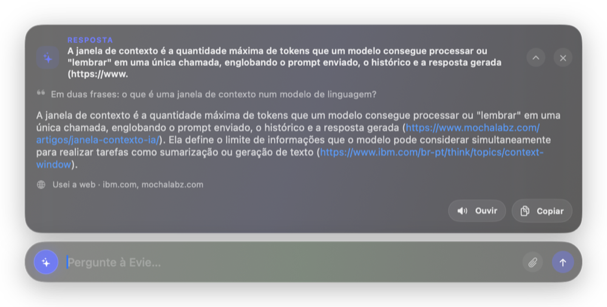
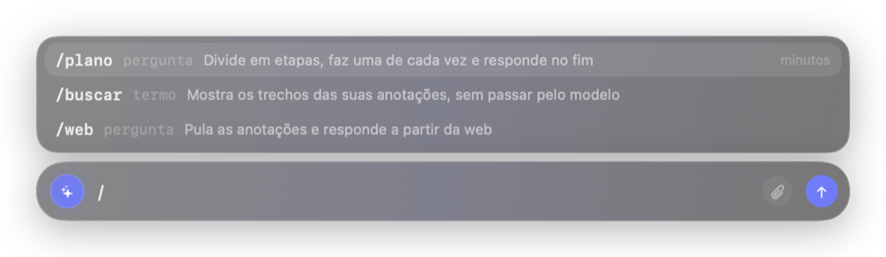
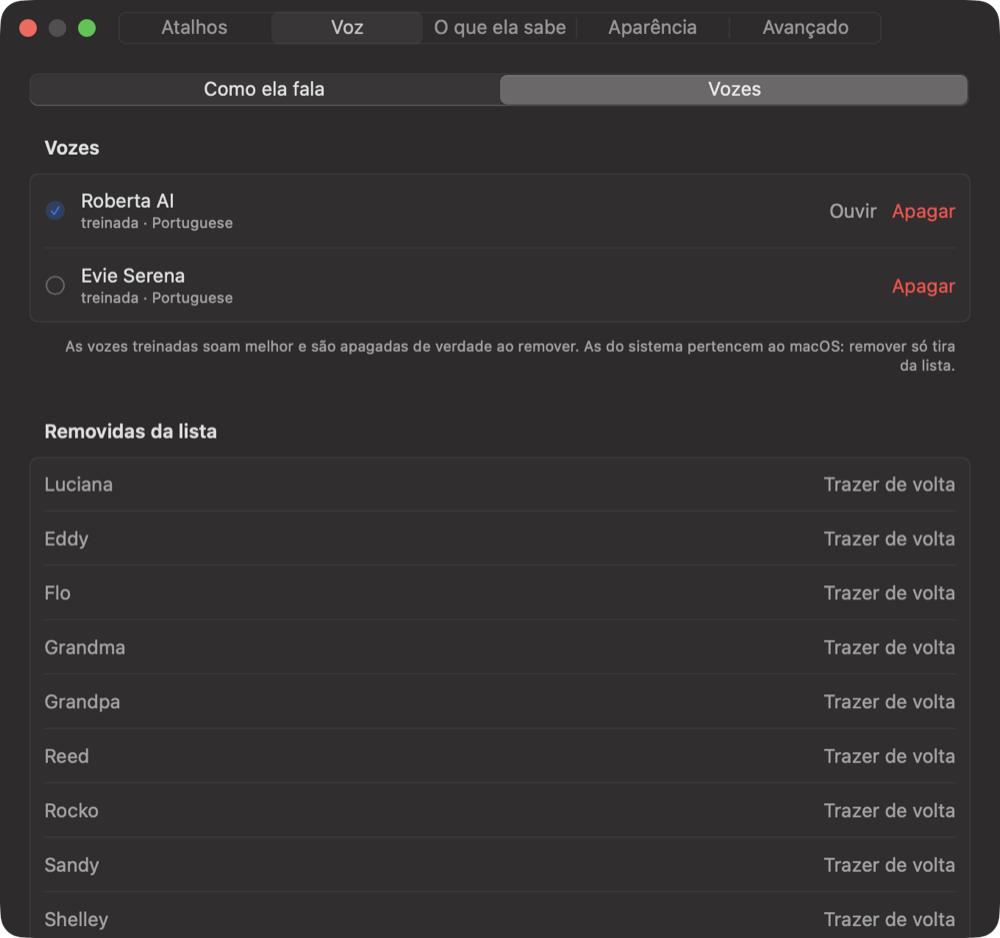
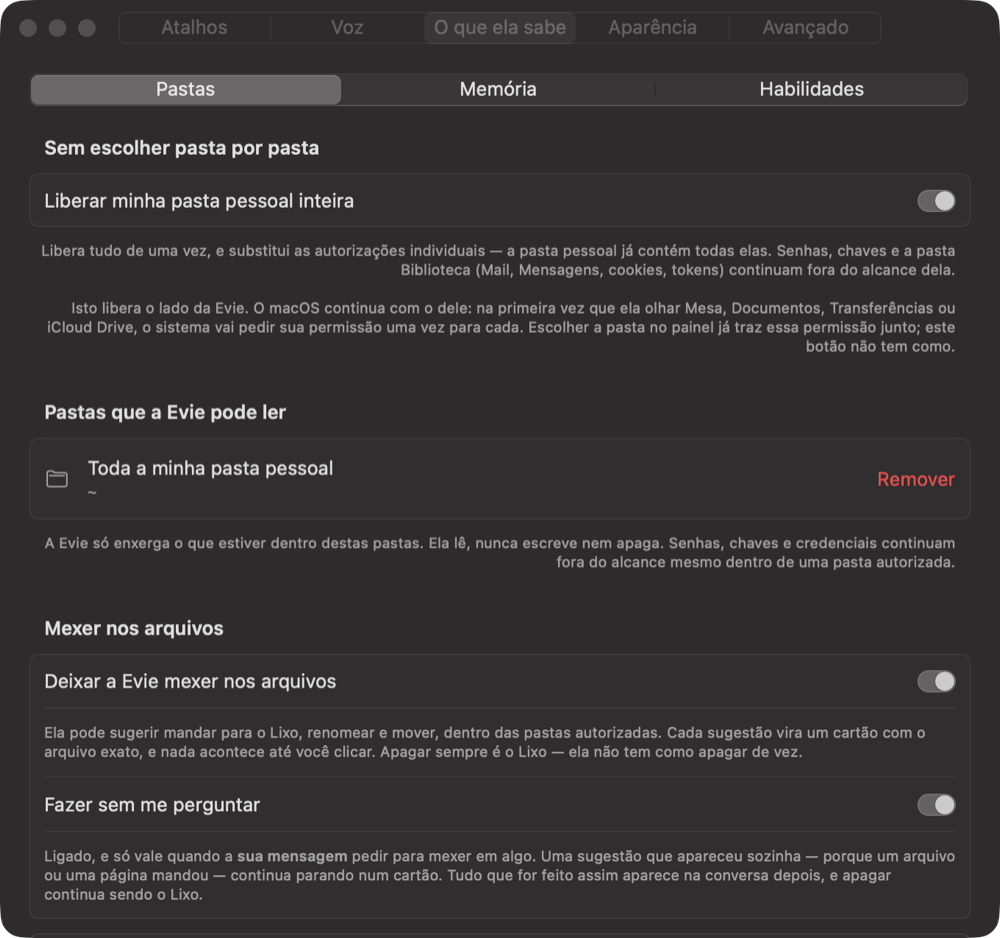
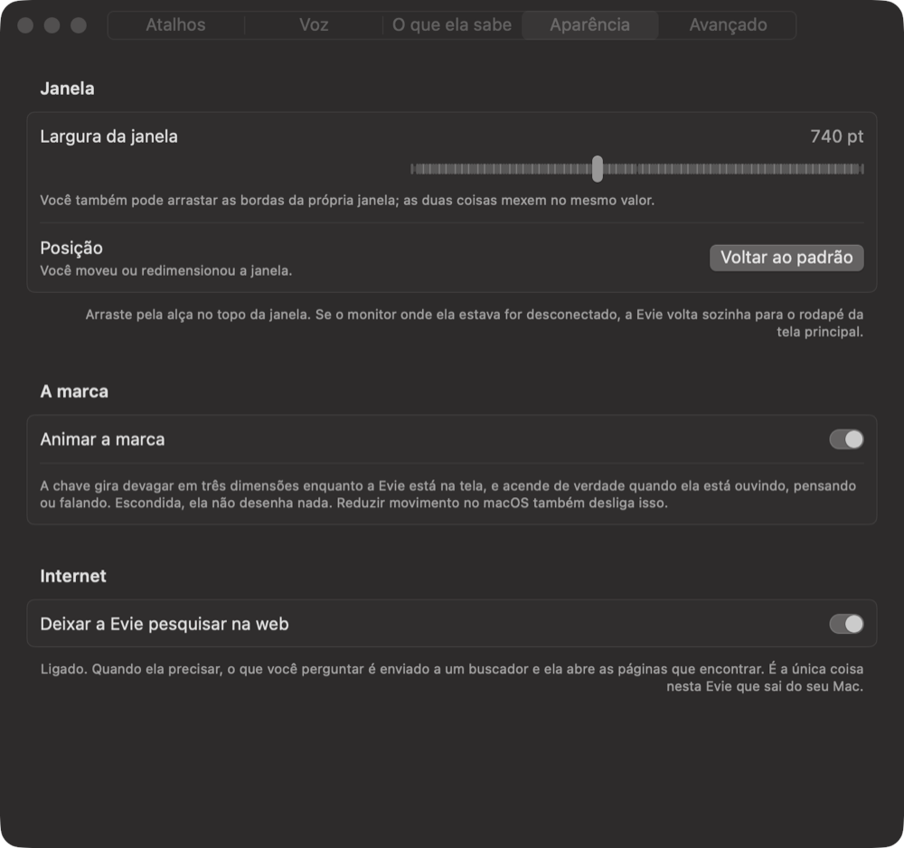
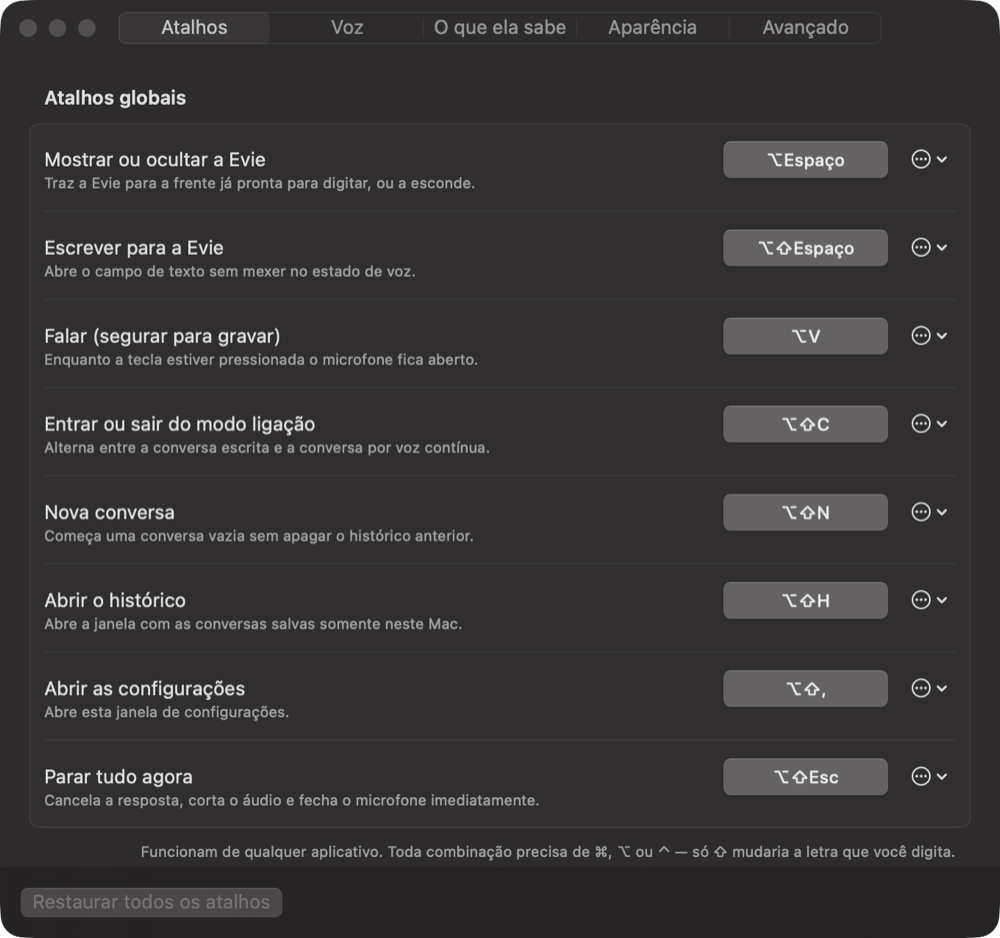
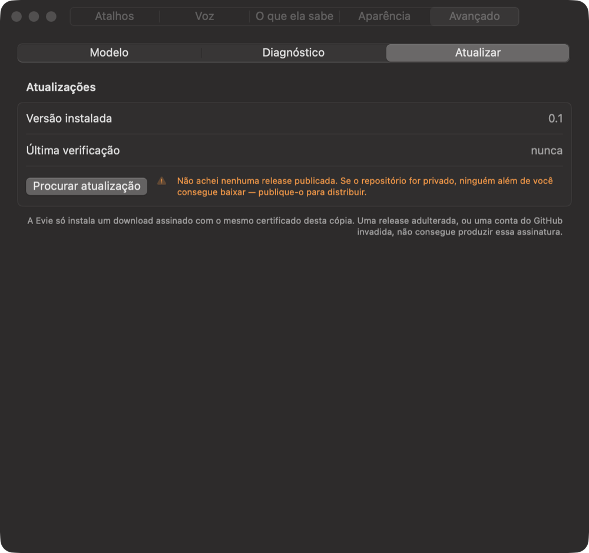

# Evie

A personal assistant that lives on your Mac and never leaves it. Pronounced
**"ívi"**. No account, no subscription, no network — the model, your voice, your
notes, and your conversations all stay on the machine. She is macOS-only, and
not by accident: she is built out of the microphone, speech, vision, and
signing services this operating system provides, and there is no other build.

She is a shortcut away rather than a window you keep open: press `⌥Space`, ask,
and she goes back to being invisible.


---

## Contents

[The story](#the-story) ·
[What she is held to](#what-she-is-held-to) ·
[What she does](#what-she-does) ·
[Requirements](#requirements) ·
[Install](#install) ·
[Using her](#using-her) ·
[What she deliberately does not do](#what-she-deliberately-does-not-do) ·
[What she costs to run](#what-she-costs-to-run) ·
[Where things live](#where-things-live) ·
[Build, test, release](#build-test-and-release) ·
[Limitations](#honest-limitations) ·
[Documentation](#documentation)

---

## The story

Evie started as a question rather than a product: how much of a useful assistant
can run on one laptop, with nothing sent anywhere? The commit history is the
honest record of finding out, and most of it is the machine correcting an
assumption.

**She needed a name before she could hear.** The first attempt at voice was not
slow, it was frozen. `Scripts/evie-app` records why, in its own comment: touching
`AVAudioEngine().inputNode` from an unbundled binary *hangs the main thread
indefinitely inside `coreaudiod`*, because macOS identifies a process by its
executable, attributes the request to the terminal that launched it, and finds no
usage description to put in a dialog. Nothing about voice could be built until
Evie was a bundle with a stable identity — which is also why `Scripts/evie-app
identity` exists, and why launching the binary directly is still the wrong thing
to do.

**She had to sound like something.** macOS ships natural Siri voices in
Brazilian Portuguese and a third-party application cannot instantiate them —
verified, they return `nil` inside the bundle (`23b5b38`). What was left was
audibly synthetic, and that commit says so plainly: cloning a voice is "not a
nicety; it is the only route to Evie sounding like anything other than a 2005
screen reader." So a voice engine was added, as a separate process that Evie does
not start at login, because "a heavy worker that starts itself takes a resource
decision away from the person whose machine it is" (`53fc794`).

**Then the voice engine looked slow, and was not.** A cloned voice took 19.1 s
for a phrase a designed voice did in 1.5 s. The engine was re-transcribing its
own reference recording on every single phrase. Storing that transcription once
brought the same voice to 1.7 s — twelve seconds of speech went from 20.4 s to
3.4 s, "which is four times slower than real time to three times faster." The
commit's own conclusion: **the engine was never slow** (`2ec0e58`).

**A measurement was published and then retracted.** An earlier comment claimed
the model's responses degraded with server uptime, on the evidence of a
1657-second request. The lid had been closed for part of it. Re-measured awake
after 1h39m: 6.6–6.9 s for 128 tokens, no drift, no defect. The lesson is written
into the code that carried the wrong claim: *never time a local model with wall
clock across a background run* (`c8ba919`, `Sources/EvieCore/EvieAgentLoop.swift`).

**Planning was made to cost less rather than promised to.** `/plano` cost 425 s
on a question; after cutting the step ceiling from six to four and dropping a
concluding step that alone cost 75 s, the same question cost 223.7 s (`627c64e`).
The steps run one at a time because that too was measured: three concurrent
requests took 23.3 s against 8.1 s for one, so fanning out costs 2.9× and buys
nothing (`98cc801`).

**Vision arrived by asking the Mac what it already had.** The plan was a second
model — "two to four gigabytes, a download, another process. That was the plan
until this Mac was asked what it already had" (`8f63c75`). The system model
described a picture in 1.52 s and costs +15 MB in this process, because it runs
in a daemon (`docs/VISION.md`).

**The wake phrase threshold was measured, not chosen.**
`Sources/EvieCore/EvieWakePhrase.swift` records the whole experiment: the
mis-hearings a Brazilian-Portuguese recogniser actually produces for "Ei, Evie" —
"ei ivi", "ei evi", "ei eve" — score between 0.667 and 1.000, while twelve
ordinary sentences including the deliberately close "seis e meia" never exceed
0.500. The constant is 0.6, sitting in that gap. "The first attempt used 0.7 and
dropped 'ei ivi', which is exactly the mis-hearing that made her never come."

**A fix that was already written did not travel.** Searching the notes had never
found anything, and it took three faults stacked on each other to keep it that
way: an index built only when a folder was granted, then a walk over the whole
home folder — more than a million files, still going after 25 seconds — then a
budget filled before it ever reached the vault. Underneath was a trap this
repository had already documented, with its own measurement, in a neighbouring
function: listing a directory with `.skipsHiddenFiles` returns nothing for an
iCloud vault, because `~/Library` is hidden. Measured again at the second site: 0
entries with the option, 2 without (`e5422cc`). The comment existed; nobody
grepped for it. Both sites now point at each other.

**And updates are checked against a key, not a promise.** Evie installs a
download only if its code signature matches the copy already running, verified
against deliberately tampered bundles of this very app (`fa82f39`).

The full record is [the work log](docs/WORKLOG.md) and
[the changelog](CHANGELOG.md).

---

## What she is held to

These are not aspirations. Each one is enforced in code, and most of them exist
because the alternative was tried first.

**Never claim something the machine did not do.** This is the rule the rest hang
from. It shows up in the smallest places:

- Stopping the microphone stops the audio engine instead of discarding buffers,
  because "muting by discarding samples would leave the system microphone
  indicator lit while claiming Evie is not listening, which is exactly the kind
  of dishonest state this project refuses"
  (`Sources/EvieShell/EvieAudioCapture.swift`).
- The speaking state follows the first real audio buffer, not the call that asks
  for it: "claiming she is speaking before any audio exists would be the exact
  kind of dishonest indicator this project refuses"
  (`Sources/EvieShell/AppCoordinator.swift`).
- The ring around her mark is the real amplitude of what is being heard "rather
  than a decoration pretending to be one"
  (`Sources/EvieShell/EvieSpeechOutput.swift`).
- `/buscar` makes no model call, including when it finds nothing, because "an
  answer written from memory and shown where a search result belongs would be a
  lie about where the information came from"
  (`Sources/EvieCore/EvieSearchCommands.swift`).
- Removing a system voice hides it rather than claiming to delete it: macOS owns
  those files. "Hiding is the honest version of removing"
  (`Sources/EvieCore/EviePreferences.swift`).
- She shows the orange microphone dot when she is listening for her name.
  `Sources/EvieShell/EvieWakeListener.swift` is unusually blunt about it: "One
  thing cannot be hidden, and pretending otherwise would be the dishonest kind of
  interface this project refuses" — macOS shows that dot whenever *any*
  application has the microphone open, Siri escapes it only by running on the
  always-on processor no third-party app can reach, "so while Evie is armed, the
  dot is on. That is the true statement, and the settings pane says it."

**Nothing leaves the Mac unless you sent it.** The inference client refuses a
non-loopback endpoint. There are two exceptions and no others: web search, which
is off by default and says so where you turn it on, and an e-mail you approved by
pressing the button on a card that showed you every recipient and the whole text.

**She cannot claim a capability she does not have.** The system prompt is
generated from a snapshot of what is actually wired up, so a preference that is
switched on but unimplemented does not become a promise. `evie-shell
--print-persona` prints exactly what she has been told about herself.

**The model never sees a filesystem path.** Authorised folders are opaque
identifiers; every lookup is relative to one. A path she was not given is a path
she cannot name or repeat into an answer.

**Authorising a folder is not authorising its credentials.** `.ssh`, `.env`,
keychains, private keys, browser cookies, and `~/Library` stay unreadable inside
an authorised folder, and listings say how many entries were withheld. The
whole-home-folder switch "bypasses Evie, not macOS" (`0fdbb98`).

**Untrusted text is fenced, never obeyed.** File contents, tool results, and
document text arrive wrapped in a marker that says they are data. Verified: a PDF
instructing her to ignore her instructions was reported as an attack. And the
deeper defence is structural — "prompt injection cannot call a function that was
never declared" (`6856733`).

**A prompt is a request; code is a guarantee.** When the model was told not to
wrap answers in JSON and did it anyway, the fix went into the parser, not the
prompt (`8f63c75`).

**Nothing is approved by summary.** When she loads a skill you wrote, the card
shows the instructions in full, because "agreeing to a summary is signing a page
you were not shown" (`d0fbf05`). The card that sends an e-mail is the same rule
under more pressure: every recipient written out in full, one per line, and the
entire body — never "3 pessoas" and never a shortened text, because approving a
summary would be approving something other than what leaves.

---

## What she does

### Conversation, locally

A local model answers in Brazilian Portuguese, streamed into a card you can stop
at any point. History is kept on this Mac and nowhere else.


While an answer is running the send button is a stop button, "because the thing
you most want to do to a running answer is end it"
(`Sources/EvieShell/QuickTextEntryView.swift`).



Every answer carries a line saying where it came from — here, `Usei a web ·
ibm.com, mochalabz.com`, because web search was switched on and she used it. An
answer written from what the model already knew says that instead. The commit
that added it is called "Say where every answer came from, and mean it"
(`8ccce28`), and a later one removed a case where the card credited a source that
had contributed nothing (`c61f65f`).

### Typed commands

Type `/` and the catalogue appears above the field, each row saying what the
command costs. Anything that is not the start of a command — a question, a date,
`2/3` — leaves the menu shut.



| Command | What it does |
|---|---|
| `/plano` | Breaks a question into steps, runs them one at a time, then writes one answer. Costs minutes. |
| `/buscar` | Shows the passages from your notes that match, with no model call at all. |
| `/web` | Skips the notes and answers from the web. Refuses if web search is switched off. |

### Voice

She speaks with a macOS voice or with one you trained, and she listens: hold a
key, click her mark, or turn on answering to her name. Speaking a question gets
a spoken answer; typing one gets a written answer, unless you ask otherwise.


Trained voices are made from a clean ten-to-thirty-second recording. Writing out
what the recording says is optional and saves about twenty-three seconds the
first time she uses that voice — measured at 23.0 s for the one profile without
stored reference text, against 0.5–1.4 s for the rest (`docs/VOICE.md`).



### Reading your Mac

Authorise a folder and she can list it, search it by name, search inside the
text, and read what is in it. If you use Obsidian, your vault is offered
directly. Everything she can reach is on this pane, and nothing she cannot reach
is.



She reads images and PDFs, including scanned ones, and — on macOS 27 — describes
what a photo, chart, or screenshot *shows*, not only the text in it. The text
reader stays beside the describer rather than being replaced by it: asked about a
chart, the system model reported four bars for four months at 120, 190, 90, 260,
and the reader pulled the exact labels. "Alone, the description would risk
inventing the numbers and the recognised text is a heap of digits with no shape"
(`8f63c75`).

### Your mail and your agenda

Off by default, in Settings › O que ela sabe › Mail e agenda. Switched on, she can
read the last messages, search them, and read a stretch of the calendar — through
the Mail and Calendar applications that already hold your Gmail and iCloud. There
is no account to connect, no Google application, and no token anywhere on this
Mac.

**She can send a message, after you press a button.** Ask her to write to
somebody and she calls `propose_mail`, which sends nothing: it works out who the
message would go to, reads back the account it would leave from, and draws a
card. The card is written for the mistake that actually happens, which is the
wrong recipient rather than a typo in the body — **every address in full, one per
line**, the sending account, the subject, and the whole text. Nothing is counted
("3 pessoas"), shortened or summarised, and if it does not fit, the card grows.
Three buttons: **Enviar**, **Salvar rascunho** and **Não**. There is no
auto-approve for it, ever, even if you switched auto-approve on for file changes.

**An address she invented is refused, not flagged.** Every recipient has to be an
address you gave her, one she read in a message, or one you let her remember —
matched whole, so a conversation that only ever said `pedro@empresa.com.br` does
not vouch for `pedro@empresa.com`, and an address she wrote herself a moment ago
is never evidence for itself. Asked to write to somebody she has no address for,
she asks you for it. What that catches is an invented address; what catches a
hostile one planted in a message she read is the recipient list on the card,
which is why nothing on it is ever shortened.

**"Salvar rascunho" reaches nobody**, files the same message in Rascunhos, and is
there because "quase certo, muda uma palavra" is the common case — Mail is where
editing and sending belong. **"Não" writes nothing anywhere** and leaves the
message on screen, so a composition you wanted with one word changed is not
thrown away with the card.

**Deleting, replying, filing and marking read still do not exist.** No tool was
written for any of them, so a message telling her to clear your inbox is asking
for something that does not exist. Attachments were not built either: a file
leaving this Mac is a different decision from a message you dictated.

**Inviting people to an event she cannot do, and it is not a policy.** Measured
on this Mac on 2026-08-07: Calendar's `make new attendee` fails with error -1719
and leaves the attendee list empty, and passing attendees to `make new event`
fails with -1700 — every attendee property is read-only in Calendar's scripting
dictionary. Asked to invite somebody, she offers to send an e-mail with the
details of the appointment instead.

**On the agenda she can put one thing, after you press a button.** Ask her to
book something and she calls `propose_event`, which creates nothing: it works out
the date, reads back the real names of your calendars, and draws a card that
spells the weekday out — "terça-feira, 12 de agosto" rather than an ISO stamp,
because a wrong date is the thing you can only catch if it is written the way you
think. The event exists when you press the button and not before. There is no
auto-approve for it, even if you switched auto-approve on for file changes.

She refuses rather than guesses: a date more than five minutes past, a span over
thirty days, an empty title, an end at or before the start, a calendar name that
does not exist (answered with the real list, never quietly swapped for the
default), and a time carrying a timezone — honouring a `Z` would move a 10:30
call to 07:30 and the card would show the moved hour.

The scripts are fixed text inside the application — the ones that write and send
exactly like the ones that read — and everything you type travels beside them as
an argument, never as part of the program. That is the same rule that keeps a web
page from being an instruction, checked by tests that hand the real `osascript`
break-out payloads — in a search term, in an event title, and in a message's
subject, body and recipient — and assert nothing happened (`docs/SECURITY.md`).

### Knowing what day it is

She did not, until recently. Every answer about "hoje", "esta semana" or how long
is left until a deadline was a guess written in the voice of a fact. The date now
sits in what she is told about herself and the exact time travels with each
question — separately, and for a measured reason. The unchanging part of the
prompt is a cache: 42% of prompt tokens on this Mac are served from it, over the
last forty requests in the server's log. A prompt carrying the current minute
changes every turn, so the cache never matches and the whole thing is reprocessed
— precise to the minute, paid for on every question (`docs/MODEL_STRATEGY.md`).

### Arithmetic

Sums go to a calculator rather than to the model, because a wrong one looks
exactly like every other sentence it writes. It is a real parser over a fixed
grammar and deliberately not the system's expression evaluator, which would run
function calls hidden inside the text. It reads `1.234,56` and `1,234.56` as the
same number, takes percentages the way people ask for them — `15% de 240`, "de 80
para 100" — and prints the reading it used above the result, so the one ambiguous
case is visible rather than silent. Nothing comes back as `NaN`: a division by
zero is a sentence explaining itself.

### Asking her things while you are away

Settings › O que ela sabe › Agendamentos: a question, and when to ask it — every
day at a time, on the weekdays you choose, or whenever a folder changes. macOS
wakes her, she asks it, she writes the answer into the history and posts a banner,
and she exits. **Nothing of hers is running in between**: there is no daemon and
no timer, only a job `launchd` already knows how to hold.

A scheduled question is the same question a typed one is — same persona, same
memories, same folders, same web setting — so it can do no more at eight in the
morning than it could at the keyboard. Two that overlap do not queue: the second
skips, because a summary of the morning delivered after the morning has started is
worth less than the next one.

### Changing a file, once you say so

Off by default. Switched on, she can suggest sending to the Trash, renaming, and
moving, inside authorised folders only. Each suggestion becomes a card naming the
exact file, and nothing happens until you press the button. Deleting always means
the Trash — she has no way to delete for good.

There is a narrower switch that skips the card, and its scope is deliberate: it
applies only when *your own message* asked for a change, so a document telling
her to delete something still produces a card you decline
(`Sources/EvieCore/EviePreferences.swift`).

### Memory, skills, web search

When she thinks she has learned something durable about you, she asks — a card
with two buttons. Nothing is stored until you press one, and Settings › Memória
lists everything she keeps, one line each, deletable.

Skills are files you write. They are loaded only when they match what you asked —
a commit-message skill loaded for a question about commit messages cost 448
characters of context (`d0fbf05`).

Web search is off by default and is the only thing in Evie that leaves the Mac.

### The window itself

Movable, resizable, and returned to the bottom of the main screen by itself if
the display it was on goes away.



---

## Requirements

| | |
|---|---|
| Machine | Apple Silicon |
| System | **macOS 26 or newer.** macOS 27 for describing what an image shows |
| Disk | about 25 GB free |
| Tools | Apple's Command Line Tools. Full Xcode is not required |
| Not supported | Intel Macs, and every operating system that is not macOS |

The development and measurement machine is a base M5 MacBook Pro with 24 GB of
unified memory on macOS 27 (`docs/MODEL_STRATEGY.md`). Every timing in this
repository was taken there; none of them are estimates for other hardware.

---

## Install

Four commands, once. Everything lands outside this checkout, in
`~/Library/Application Support/Evie/`.

```bash
Scripts/evie-runtime setup     # fetch and build the model server, download the model
Scripts/evie-app identity      # a signing identity, so permissions survive rebuilds
Scripts/evie-app build
Scripts/evie-app install       # into ~/Applications
```

**Run `identity` before `build`, not after.** A self-signed certificate is what
gives the bundle a stable designated requirement, which is what lets macOS prove
build N+1 is the same code as build N. Without it the bundle is signed ad-hoc,
every rebuild asks for the microphone again, and — because an update is verified
against this same certificate — Evie **refuses every update rather than accepting
any**. `identity` prints one step that cannot be scripted: open Keychain Access
and mark the certificate as trusted for code signing.

This is not a Developer ID. It keeps permissions across rebuilds on this Mac and
nowhere else, and it does not pass Gatekeeper on another machine.

Then, whenever you want her running:

```bash
Scripts/evie-runtime start     # the model. ~15 GB resident, so it is explicit
Scripts/evie-app run           # Evie herself
```

**Always launch with `Scripts/evie-app run` or from `~/Applications`, never the
binary directly.** Running the executable from a terminal makes macOS attribute
the microphone and folder permissions to the terminal instead of to Evie.

The model runtime is a pinned local inference server holding the primary model,
about 14.3 GB installed (`docs/adr/0007-local-development-runtime.md`), served
over loopback with a 64K context. `Scripts/evie-runtime status|doctor|smoke`
reports on it.

For a voice that does not sound synthetic, pick a trained voice in Settings ›
Vozes. The voice engine is optional: system voices work without it, and a
failure there falls back to a system voice and says so. Evie starts the engine
herself the first time she is asked to speak with a trained voice — measured at
6.66 s from stopped (`c93835d`), and roughly 2.4 GB resident while it is up.
Nothing loads at login, and a system voice never starts it.

```bash
Scripts/evie-voice status
Scripts/evie-voice stop
```

---

## Using her

| Shortcut | What it does |
|---|---|
| `⌥Space` | show or hide Evie |
| `⌥⇧Space` | open the text field |
| `⌥V` | hold to speak |
| `⌥⇧C` | enter or leave call mode |
| `⌥⇧N` | new conversation |
| `⌥⇧H` | history |
| `⌥⇧,` | settings |
| `⌥⇧Esc` | stop everything now |

All of them are reassignable, and every one also appears in the menu-bar menu, so
a shortcut the system refuses can never make something unreachable.



**Typing.** `⌥Space`, type, `Return`. She answers in writing.

**Talking.** Click her mark, or hold `⌥V`. Stop talking and she notices — there is
nothing to press to say you have finished. She answers out loud, because you asked
out loud.

**Calling her by name.** Turn on Settings › Voz › "Atender quando eu chamar pelo
nome". She shows nothing while waiting — no waveform, no listening state — and
keeps nothing beyond an 80-character tail that is thrown away every minute.

The microphone does have to stay open, and macOS shows its orange indicator
whenever any app holds it. There is no way around it, so Evie says so instead of
implying otherwise. What arming actually costs was measured rather than guessed:
about 4.4% of one core across the three processes involved, against about 7% for
the microphone itself (`Sources/EvieCore/EvieWakeGate.swift`).

The same pane shows what the recogniser actually heard, which is the point:
"Evie" is not a Portuguese word, so pt-BR recognition builds it from real ones.
Say the phrase, read what came back, and add it as a variant — separated by
semicolons, since a comma is part of "Ei, Evie":

```
Ei, Evie; ei ivi; ei ive
```

**Commands.** Type `/` and the commands appear above the field, with what each
one costs. `↑` `↓` to choose, `Tab` or `Return` to take one, `Esc` to close the
list without closing Evie.

**`/plano`.** Ask for something that takes several moves and she breaks it into
steps, runs them one after another, and then writes one answer from what they
found.

```
/plano compare o HTTP/2 com o HTTP/3 e diga qual eu deveria usar
```

It is a typed command and never a guess, because it costs one model call to plan,
one per step, and one to answer — minutes rather than seconds on this hardware.
The plan stays on screen while it runs. Stop is live at every step, a step that
fails does not end the run, and whatever the finished steps found still becomes
an answer — one that says which steps were missing rather than quietly leaving
them out.

**Call mode.** `⌥⇧C`, then click the mark: the window becomes voice only. She
speaks, the microphone reopens by itself, and it keeps going until you click again.

**Attachments.** Drag a file onto the window, paste one, or use the paperclip.
What is attached sits beside the field as a chip — "this is attached, not sent,
and here is the cross that takes it back" — rather than as a card that would look
like something already asked (`Sources/EvieShell/QuickTextEntryView.swift`).

**History.** `⌥⇧H` opens the conversations kept on this Mac. `⌥⇧N` starts a new
one without deleting the old.

**Settings.** Five tabs — Atalhos, Voz, O que ela sabe, Aparência, Avançado —
and not more, for a measured reason: macOS gives a tab bar a fixed amount of room
and folds whatever does not fit into an overflow menu, so growing the window one
tab at a time silently replaced the bar with a chevron
(`Sources/EvieShell/Views/SettingsView.swift`). New things go inside a tab
instead: "O que ela sabe" now holds five panes — Pastas, Memória, Habilidades,
Mail e agenda, Agendamentos.

---

## What she deliberately does not do

**She never writes to your Obsidian vault.** She reads it to answer — what you
wrote about a project, a company, a decision — and that is all. Your notes are a
source, not a workspace she shares.

**She never sends a message you have not read.** She can write one now, which she
could not until `6dade94`, and this entry said she could not touch your mail at
all until then. The guarantee has the same shape as the others rather than a
weaker one: the tool she can call sends nothing, and the two functions that reach
Mail live on a third protocol her loop does not hold and cannot be given. Only
the buttons on the card call them, and there is no auto-approve path for mail
under any setting.

**She never writes to an address you never gave her.** A recipient has to appear
in what you said, in what she read, or in what you let her remember — matched as
a whole address. She cannot cite her own earlier sentence as evidence that an
address exists.

**She never attaches a file and never replies to a message.** No tool exists for
either. A file leaving this Mac is a different decision from a message you
dictated, and a reply would mean guessing which message was meant — guessing
wrong sends your text to the wrong person.

**She still never deletes, files, or marks your mail read.** No tool exists that
does, so a message telling her to clear your inbox is asking for something that
does not exist. The guarantee is not that she has been told to behave — it is
that her vocabulary has no word for it.

**She never puts anything in your calendar on her own.** She can now create one
event, which she could not until `b9bd7a0`, and the guarantee has the same shape
as the one above rather than a weaker one: the tool she can call proposes and
performs nothing, and the function that writes lives on a protocol her loop does
not hold. No sentence in a message, a web page or a document reaches it — only
the button on the card. She cannot change or delete an event that already exists.

**She never sends anything without being told.** Two things in Evie reach beyond
this Mac and both are deliberate: web search, which is off by default and says so
on its switch, and a message you approved on a card by pressing the button.
Nothing else leaves.

**She never deletes for good.** There is no tool in her vocabulary that
permanently destroys anything; the strongest thing she can do to a file is put it
in the Trash, and only after you approve the card that names it.

**She never hides the microphone indicator.** She could not, and she would not
want to. See above.

**She does not run at login and does not keep the model warm for you.**
`Scripts/evie-runtime start` is an explicit decision because it costs about 15 GB
of memory, and the voice engine's 2.4 GB is the same decision made the same way.
Leaving her open costs nothing measurable: 0% of a core for both processes while
idle, 10 MB resident for Evie and 9 MB for a server nobody has asked anything in a
while, measured with its method written down (`docs/RESOURCE_BUDGET.md`). A
question is a burst — 130% of one core of ten, back to idle within seconds — not a
tax on the day. What that burst costs in heat and energy is measured too, below.

**Nothing of hers runs between scheduled questions.** A schedule is a job
`launchd` holds; when it fires, Evie starts, asks, answers, and exits.

**She does not pretend a copy was a move.** When a rename crosses volumes the
writer refuses, because "pretending a move happened when a copy did would be
worse than refusing" (`Sources/EvieCore/EvieFileWriter.swift`).

Not built: changing or deleting a calendar event, replying to a message,
attaching a file, Drive, WhatsApp, and workflow automations — she authors no
macOS Shortcut and runs none. Inviting people to an event is not a matter of
building it: Calendar on this Mac refuses to take an attendee from a script at
all, measured, and she says so and offers an e-mail instead. Creating an event
and sending a message are built, and they are the two exceptions to the list
above — each behind a button. She is told exactly which capabilities are wired up
and will say so rather than pretend.

---

## What she costs to run

Measured on one MacBook Pro (`Mac17,2`, Apple M5, 10 cores, 24 GB, macOS 27) on
AC power, on 2026-08-07, with Adobe Creative Cloud, Chrome and a Terminal running
throughout — the machine as it is actually used, not a clean room. Ten questions
were asked back to back; the idle and recovery windows are 59 s and 58 s either
side of them.

| | Idle | Answering | Back to idle |
|---|---:|---:|---:|
| Model server CPU (% of one core, of ten) | 0.0% | 101.3% | 0.0% |
| Model server resident memory | 513 MB | 1,566 MB peak | 1.1 GB after 60 s |
| GPU utilisation (whole machine) | 20.5% | 74.8% mean, 87% peak | 21.4% |
| System free memory | 48–49% | 29–38% | 49–52% |
| Thermal state / CPU throttling | nominal / none | nominal / none | nominal / none |

Ten questions took 95.4 s and produced 1,738 tokens — 9.5 s and 18.2 tokens per
second each, with throughput drifting down 7.3% from the first five to the last
five. The machine never throttled and macOS never left `nominal` thermal state.

The number that puts it in proportion: over those same 95 seconds, Adobe Creative
Cloud spent **2.5× more CPU than Evie did** — and unlike Evie it was spending it
in the idle windows too, at around 250% of a core, continuously, for nothing
anyone asked for. Evie's cost starts when you ask and stops when she answers.

**On mains power no wattage exists** — `powermetrics` needs `sudo`, and a plugged-in
battery reports zero current — so the figures above use GPU utilisation as the
proxy. Unplugged, the battery reports a real current, and it was measured on the
same machine on 2026-08-07, sampled at 1 Hz and reduced to a median:

| Battery, Low Power Mode off | Idle | Generating |
|---|---:|---:|
| Draw, time-weighted | **5.6 W** | **31.1 W** |
| Cross-check, from mAh the battery lost | 1.9 W | **27.2 W** |
| Thermal state / CPU throttling | moderate / none | moderate / none |

**A question costs about 25.5 W on top of what the machine already spends**, and
about 8.6 s, which is **218 J — 0.061 Wh**. Against this battery's 70.6 Wh of
real capacity that is roughly **1,160 questions per charge**, or **4.3% of the
battery for fifty questions in a day**.

That marginal figure was measured twice on the same machine loaded two different
ways — once with Adobe Creative Cloud running and once with it quit. The idle
baselines differ by a factor of three, 20.0 W against 5.6 W, and the *difference*
between idle and generating agrees within 4%. Which is also the other finding
worth having: **Adobe idling cost more than half of what a question costs while
answering**, and quitting it roughly tripled this Mac's endurance at rest.

**Unplugging costs no speed.** A clean 32-question run on battery produced 4,940
tokens in 273.6 s — **18.1 tok/s** against 18.2 on AC — with no throttling
recorded. Throughput does drift under sustained load, 19.4 tok/s in the first
quarter against 16.7 in the last, which macOS still does not call throttling.

Run `evie-shell --energy-check` to reproduce any of it — noting that it samples
watts only at the window's endpoints, and that the battery register itself
refreshes only about every 22 s. Both are recorded with the method rather than
worked around. Full conditions and every figure:
[`docs/RESOURCE_BUDGET.md`](docs/RESOURCE_BUDGET.md).

---

## Where things live

| What | Where |
|---|---|
| Model server, weights | `~/Library/Application Support/Evie/Runtimes/` |
| Settings | `~/Library/Application Support/Evie/preferences.json` |
| Model configuration | `~/Library/Application Support/Evie/config.json` |
| Authorised folders | `~/Library/Application Support/Evie/roots.json` |
| What she remembers | `~/Library/Application Support/Evie/memory.json` |
| Skills you wrote | `~/Library/Application Support/Evie/Skills/` |
| Conversations | `~/Library/Application Support/Evie/Conversations/` |
| Scheduled questions | `~/Library/Application Support/Evie/schedules.json` |
| The jobs that fire them | `~/Library/LaunchAgents/` |
| Logs, including one per schedule | `~/Library/Logs/Evie/` |

A schedule's prompt is deliberately not in its job file: `~/Library/LaunchAgents`
is readable by anything running as you, and a prompt may say "resume meus e-mails
não lidos". Only the identifier travels there.

All of it is `0700`/`0600` and none of it is in this repository. Configuration is
built-in defaults, then that JSON file, then environment overrides; invalid
settings are shown in the overlay rather than silently accepted.

Nothing private belongs in Git — tokens, sessions, voice recordings, documents,
transcripts, indexes, and weights all live outside it. See
[.gitignore](.gitignore) and [Security](docs/SECURITY.md) before adding an
integration.

---

## Build, test, and release

```bash
Scripts/evie-app build|identity|install|run|status|uninstall
Scripts/test                                # the Swift test suite
Scripts/evie-runtime status|start|stop|doctor|smoke
Scripts/evie-voice   status|start|stop|voices|warm
```

The gate every change passes is the whole of `Scripts/test`, strict format lint,
and a release build with `-warnings-as-errors`. The suite lives in
`Tests/EvieCoreTests/` and covers `EvieCore` — the agent loop, the file toolbox,
the scoped reader, the writer, plans, retrieval, ranking, wake phrase and gate,
preferences, release verification, and the rest. The AppKit layer has no unit
tests and is covered instead by diagnostics that exercise the real paths:

```bash
evie-shell --print-persona                 # exactly what Evie is told about herself
evie-shell --audio-check                   # bundle identity and microphone status
evie-shell --speech-check                  # whether this Mac can transcribe Portuguese
evie-shell --voice-check                   # opens the microphone briefly, writes a report
evie-shell --speak-check                   # says one sentence through the whole path
evie-shell --read <file>                   # what Evie would read from an image or PDF
evie-shell --tools-check                   # a real agentic turn over a throwaway folder
evie-shell --ask-folder <folder> "<question>"   # ask a real question of a real folder
evie-shell --voices-check <audio.wav>      # train a throwaway voice, speak with it, delete it
evie-shell --web-check "<query>"           # search, read a page, and show what is refused
evie-shell --ask-web "<question>"          # a real turn with the web switched on
evie-shell --see <image>                   # what she sees in a picture, and reads in it
evie-shell --skill-check "<question>"      # which skills a question loads, and the answer
evie-shell --change-check                  # the whole propose-approve-perform path
evie-shell --schedule-check                # installs a real launchd job, waits for it, reports
evie-shell --schedules-check               # what is installed, and what launchd actually holds
evie-shell --help                          # every check, listed by the checks themselves
```

None of these open a window or ask for permission. The list above is a selection;
`--help` is generated from the same declarations dispatch uses, so it cannot drift
from what exists (`Sources/EvieShell/EvieDiagnosticRegistry.swift`).

Two claims that were only ever asserted in conversation are reproducible instead:

```bash
Scripts/evie-probe thinking   # asks for a reasoning mode three ways; all three accepted and ignored
Scripts/evie-probe vision     # switches Wi-Fi off, checks the route is gone, then describes a capture
```

### Updating

Evie checks GitHub for a newer release, at most once a day, and offers it in
Settings › Avançado › Atualizar. Nothing installs itself: looking, downloading,
and installing are three separate presses.



A download is only installed when **its code signature matches the copy already
running**. Measured against deliberately tampered bundles of this very app:

| what was done to the download        | result   |
| ------------------------------------ | -------- |
| `Info.plist` edited                  | refused  |
| a byte flipped in the binary          | refused  |
| a file added to `Resources`           | refused  |
| re-signed by somebody else            | refused  |
| untouched                             | accepted |

That means a compromised GitHub account is not enough to ship code to an
installed Evie — the attacker would also need the signing key, which never
leaves the machine that made it.

Because the identity is self-signed, this only holds for builds made on the same
Mac. Without one Evie is signed ad-hoc, has no certificate, and refuses every
update rather than accepting any.

### Publishing a release

```bash
Scripts/evie-release 0.2.0
```

It refuses a version it cannot order, refuses to overwrite an existing tag,
refuses a dirty working tree, builds, **refuses to publish an ad-hoc bundle**,
packs with `ditto` rather than `zip` — the signature is computed over extended
attributes and symlink structure that `zip` silently drops — then re-extracts the
archive, verifies that copy still passes a strict signature check, tags, and
uploads. For anyone other than you to download it, the repository has to be
public.

---

## Honest limitations

From [Project status](docs/PROJECT_STATUS.md), which is the document to trust
over this one when they disagree.

- **The performance suite does not exist yet.** Bounded first-test measurements
  were taken, and sustained load, energy and battery draw have now been measured;
  long-context comparisons at 16K/32K/64K and answer-quality results have not.
- **Speech recognition is implemented but unmeasured.** The system reports
  Brazilian Portuguese available after a one-time language pack. Accuracy,
  latency after that download, barge-in, and energy cost are not yet benchmarked.
- **Semantic memory across conversations does not exist.** Retrieval is agentic
  search over authorised folders, which is not the same thing: she can find what
  you wrote, and remembers nothing she was told beyond the memory cards you
  confirmed.
- **The application is not notarized and is not a login item.** The signing
  identity is self-signed and local to one Mac.
- **The overlay has not been accepted by eye on every target.** Focus, Spaces,
  full-screen, multiple displays, and accessibility behaviour are open QA.
- **Evie does not own the model server's lifecycle.** Idle unload, crash
  recovery, power policy, and automatic startup are not hers yet; the runtime is
  started and stopped by hand.
- **Mail takes one write and the calendar takes one; both are behind a button.**
  This entry said both applications were read-only until `b9bd7a0`, and said mail
  was until `6dade94`. Creating an event and sending a message are built and
  confirmed by a press; changing or deleting an event, replying, attaching,
  filing and marking read are not. Inviting somebody to an event is impossible
  here rather than unbuilt — measured, and recorded in `docs/SECURITY.md`. Drive,
  WhatsApp and workflow automations do not exist, and location triggers would
  need a trusted source the Mac alone does not provide. Scheduled work exists and
  is new: `launchd` fires it and the answer lands in the history, but the banner
  it posts goes through `osascript` because macOS refuses notifications to a
  locally-signed bundle.
- **The consent prompt for Mail and Calendar has never been observed.** The
  refusal path is covered by tests against both wordings, not by having seen it.
- **The mail confirmation card has not been used by a person.** A message was
  sent and a draft saved against the owner's own address on 2026-08-07, which
  proves the two scripts; whether anybody has yet read the card that asks first is
  not recorded. The event card has: the owner booked a real appointment through
  it, which is what passed `QA-006`.

---

## Documentation

Start with [Project status](docs/PROJECT_STATUS.md) for what is true today and
[the work log](docs/WORKLOG.md) for how it got there. Design documents:
[vision](docs/VISION.md) ·
[architecture](docs/ARCHITECTURE.md) ·
[reaching the Mac](docs/FILESYSTEM.md) ·
[macOS runtime](docs/MACOS_RUNTIME.md) ·
[voice](docs/VOICE.md) ·
[security](docs/SECURITY.md) ·
[interface](docs/UI_UX.md) ·
[models](docs/MODEL_STRATEGY.md) ·
[RAG](docs/RAG.md) ·
[web search](docs/WEB_SEARCH.md) ·
[automations](docs/AUTOMATIONS.md) ·
[Siri](docs/SIRI.md) ·
[roadmap](docs/ROADMAP.md) ·
[decisions](docs/adr/README.md).

Working on this repository: read [AGENTS.md](AGENTS.md) first.

---

## Licence

**Personal and domestic use, free. Commercial use, selling, and redistribution,
no.** Copyright © 2026 Matheus Barboza de Godoi, all rights reserved. The source
is readable so it can be studied and run, which is not the same as open source.
Full terms, including what the licence does *not* cover — the language model, the
inference server, Apple's frameworks, and your own data — in
[LICENSE](LICENSE).
